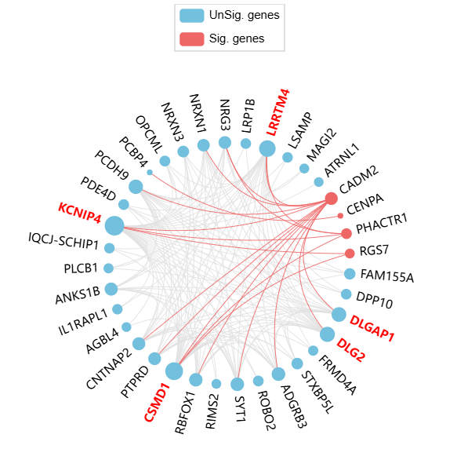
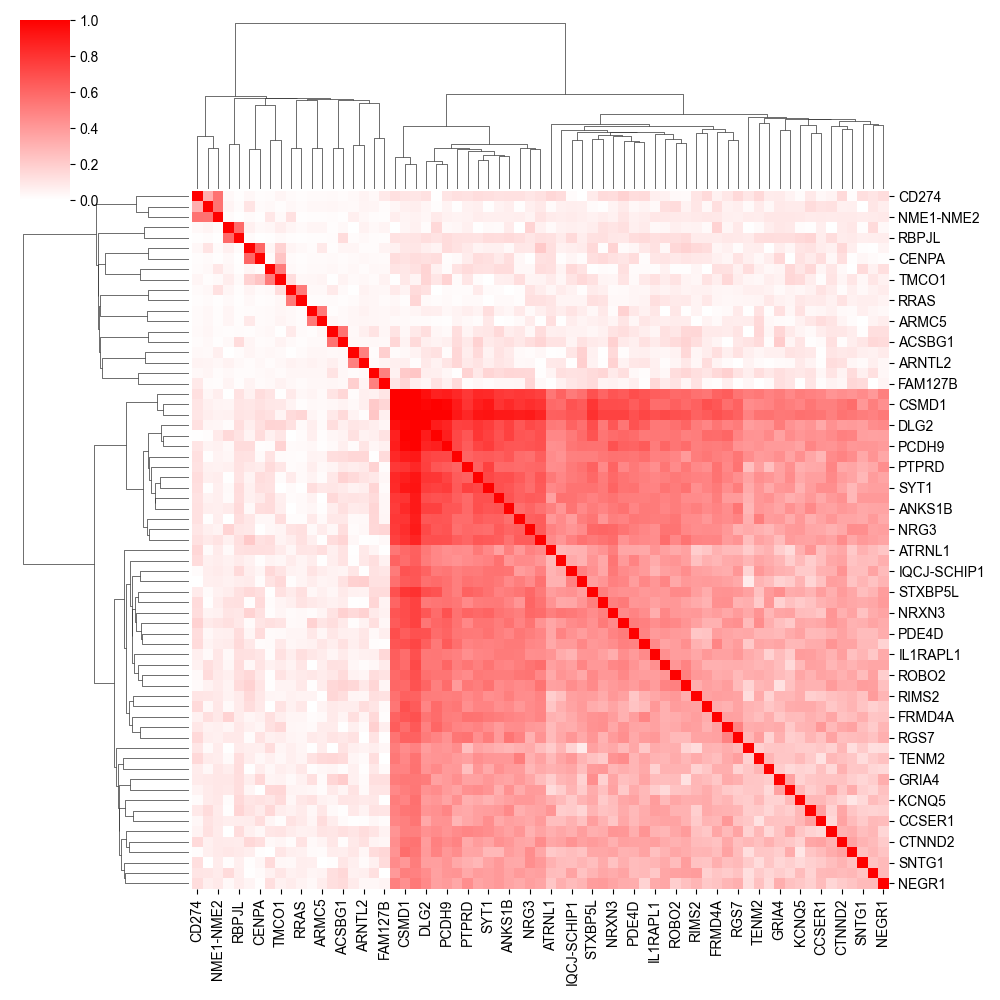

# DGN: Disease-associated gene network
DGN is a framework integrating scRNA-seq and GWAS data to explore disease-associated genes, cell types, and gene network modules from a network perspective.

## Installation
DGN requires Python >= 3.6 and Java SE Runtime Environment (JRE) >= 1.8. 
```shell
# download 
git clone https://github.com/pmglab/DGN
# install dependent packages
cd DGN
python -m pip install -r requirements.txt
# test
python dgn.py --version
```
## Quick tutorials
### Preparation of DGN Input Files
#### 1. Gene expression matrix of scRNA-seq
For single-cell RNA sequencing (scRNA-seq), the expression matrix must be preprocessed by annotating cell types and then splitting the matrix according to these cell types. 
Each cell type should have a corresponding expression matrix file, where each row represents a gene and each column represents a cell. 
The values should be tab-separated. The file should be named in the format `{CellTypeName}.txt.gz`. All expression matrix files should be placed in a single directory, 
referred to as `EXPR_DIR` in the following demonstrations.

The human and mouse reference single-cell datasets used in our DGN study can be downloaded from https://doi.org/10.6084/m9.figshare.26771971.
#### 2. GWAS Summary Statistics
The GWAS summary statistics should include three columns: chromosome number, position, and p-value. Each row represents a variant. 
The GWAS summary statistics file is referred to as `GWAS_FILE` for demonstration purposes in the following sections.
#### 3. Reference Genotype Data for LD Calculation
Reference genotype data that matches your GWAS population and coordinate version can be downloaded from https://doi.org/10.6084/m9.figshare.26771755. 
For example, the hg19 version of the European population genotype file is named `EUR.hg19.vcf.gz` and will be referred to as `REF_VCF` in the following demonstrations.

### Running DGN
Assume your output directory is set to `OUTPUT_DIR` and the abbreviation for the GWAS phenotype is `PHENO_ABBR`. The command to run is as follows:
```shell
python dgn.py \
--expression_dir EXPR_DIR \
--gwas_path GWAS_FILE \
--vcf_ref REF_VCF \
--output_dir OUTPUT_DIR \
--phenotype_abbr PHENO_ABBR
```
Make sure to replace these placeholder variables with the actual values relevant to your specific situation.

### DGN Output
Output Directory Structure:

+ The `intermediate` folder stores temporary result files generated during the network construction process.
+ The `node_score` folder stores gene connectivity profile files (and, if `--run_expr_dese` is set, gene expression profile files as well).
+ The `result` folder stores the formal DGN results, which include three aspects: disease-associated genes, cell types, and gene network modules. Detailed descriptions are provided below.

#### 1. Disease-Associated Genes
The disease-associated gene results are stored in `{PHENO_ABBR}.gene.assoc.condi.txt`. The meanings of the column names in the table are as follows:

| Header   | Description                                                                                               |
|:----------|:-----------------------------------------------------------------------------------------------------------|
| Gene     | Gene symbol                                                                                               |
| Chrom    | Chromosome of the gene                                                                                    |
| StartPos | Start coordinate of the gene                                                                              |
| EndPos   | End coordinate of the gene                                                                                |
| #Var     | Number of variants within the gene                                                                        |
| Group    | LD group number. Conditional ECS tests were performed for genes within the same LD group.                 |
| ECSP     | p-value of ECS                                                                                            |
| CondiECSP| p-value of the conditional gene-based association tests by conditional ECS                                 |
| GeneScore| Gene’s selective-expression score. A gene with a high score will be given higher priority to enter the conditioning procedure. |


#### 2. Disease-Associated Cell Types
The disease-associated cell types results are stored in `{PHENO_ABBR}.celltype.txt`. The meanings of the column names in the table are as follows:

| Header             | Description                                                                                                               |
|--------------------|---------------------------------------------------------------------------------------------------------------------------|
| TissueName         | Name of the tissue being tested                                                                                           |
| Unadjusted(p)      | Unadjusted p-values for the tissue-phenotype associations                                                                 |
| Adjusted(p)        | Adjusted p-values calculated by adjusting both selection bias and multiple testing                                        |
| Median(IQR)SigVsAll | Median (interquartile range) expression of the conditionally significant genes and all the background genes               |


#### 3. Disease-Associated Gene Network Modules
(1) The complete results of disease-associated gene modules are stored in `{PHENO_ABBR}.assoc_gene_module.txt`. 
The functional enrichment annotation results for significantly associated modules (FDR < 0.1) are stored in
`{PHENO_ABBR}.assoc_gene_module_anno.xlsx`. The meanings of the column names in the table are as follows:

| Header             | Description                                                                                                 |
|--------------------|-------------------------------------------------------------------------------------------------------------|
| module_id         | The module ID                                                                                               |
| cell_type      | The cell type in which the module is located                                                                |
| p        | The module association p-value                                                                              |
| p.adj_fdr | The p-value adjusted using the Benjamini-Hochberg FDR method                                                |
| assoc_gene_number | The number of disease-associated genes within the module                                                    |
| module_gene_number | The total number of genes within the module                                                                 |
| assoc_gene | The disease-associated genes in the module                                                                  |
| module_gene | All the genes in the module                                                                                 |
| "GO:BP," "GO:CC," and "GO:MF" | The GO enrichment results for Biological Process, Cellular Component, and Molecular Function, respectively. |
| KEGG | The KEGG pathway enrichment results.                                                                        |

(2) The visualization results of disease-significantly associated modules are stored in the `{PHENO_ABBR}.plot` folder. 
The file `{module_id}.module_network.html`contains the network diagram of the module, while`{module_id}.module_heatmap.png`shows the heatmap of the network edge weights.
For example:

|   |  |
|:--------------------:|:----------------------:|
|   `{module_id}.module_network.html`    | `{module_id}.module_heatmap.png`        |

## Complete List of DGN Parameters
### Input 1: Gene expression profile
| Flag              | Description  | Default |
|:------------------|:--------------------------|:--------|
| `--expression_dir` | Input a directory that contains gene expression profile of different cell types. Each file represents a specific cell type, with filenames following the convention "{CellTypeName}.txt.gz". |  |
### Input 2: GWAS summary statistics
| Flag            | Description                                                                                   | Default |
|:----------------|:----------------------------------------------------------------------------------------------|:--------|
| `--gwas_path`   | GWAS summary table with header.                                                               |     |
| `--chrom_col`   | Chromosome column in GWAS summary table.                                                      | `CHR`   |
| `--pos_col`     | Base position column in GWAS summary table.                                                   | `BP`    |
| `--p_col`       | P-value column in GWAS summary table.                                                         | `P`     |
| `--buildver`    | Specifies the reference genome version of the coordinates.                                    | `hg19`  |
### Output
| Flag            | Description                                                                                   | Default |
|:----------------|:----------------------------------------------------------------------------------------------|:--------|
| `--output_dir`       | Output directory. |     |
| `--phenotype_abbr`       | Phenotype abbreviation, used as the file identifier for this phenotype in the output results. |      |
### Step 1: Construction of gene co-expression network
| Flag                          | Description                                                                                         | Default   |
|:------------------------------|:----------------------------------------------------------------------------------------------------|:----------|
| `--trans_gene_symbol`         | Convert the gene ID in the expression profiles to gene symbol of HGNC.                              |       |
| `--min_expr_value`            | The minimum average gene expression level used for constructing co-expression networks.             | `0`       |
| `--min_cell`                  | The minimum number of cells or samples required in the analysis.                                    | `100`     |
| `--max_cell`                  | The max number of cells or samples required in the analysis.                                        | `1000`    |
| `--min_k`                     | The minimum value of k in normalization for co-expression network.                                  | `0.5`     |
| `--max_k`                     | The max value of k in normalization for co-expression network.                                      | `1.5`     |
| `--fold_IQR`                  | How many times the IQR is the normal range of the average `\|r\|`                                   | `1.5`     |
| `--edge_method`               | The method for calculating edge weights (i.e., gene correlations),`pearson` or `cs-core`.           | `cs-core` |
| `--resample_size`             | Sample size for resampling edge weights when correcting the co-expression network.                  | `100000`  |
| `--keep_expr`                 | No need to recalculate the gene centrality in the gene co-expression network for the next analysis. |       |
### Step 2: Disease-associated genes and cell types
| Flag                   | Description                                                                                         | Default   |
|:-----------------------|:----------------------------------------------------------------------------------------------------|:----------|
| `--vcf_ref`  | Specifies a VCF file of genotypes sampled from a reference population.                              |       |
| `--multiple_testing`     | Specifies the method for multiple testing correction. `bonf` denotes performing Bonferroni correction; `benfdr` denotes controlling false discovery rate by the Benjamini–Hochberg method; `fixed` denotes no correction.          | `benfdr`  |
| `--p_value_cutoff`           | Specifies the threshold of the adjusted p-value for fine-mapping.                                    | `0.05`    |
| `--top_n_gene`           | Maximum number of genes entering conditional association analysis.                                        | `1000`    |
| `--nt`              | Specifies the number of threads.                                  | `1`       |
| `--rm_hla`              | Remove HLA region.                                      |       |
| `--java_path`              | Java path.                  | `java`    |
| `--jvm_gb`              | JVM value (GB). | `20`      |

### Step 3: Disease-associated gene network modules
| Flag                   | Description                                                                                                                       | Default |
|:-----------------------|:----------------------------------------------------------------------------------------------------------------------------------|:--------|
| `--assoc_cell_p_cutoff`  | The adjusted p cutoff for associating cell types. The significant cell types will be used for associated network module analysis. | `0.05`  |
| `--module_gene_score_n_top_genes`     | In the module detection function, specify the number of top genes with high disease-related scores for module detection           | `5000`  |
| `--module_cut_edge_weight`           | Minimum edge weight for pruning nodes in modules.                                                                                 | `0.5`   |
| `--module_plot_cut_edge_weight`           | Minimum edge weight for pruning nodes in plotting modules.                                                                        | `0.6`   |
| `--show_node_label_top_n`              | Display the labels of the top n genes by connectivity.                                                                    | `5`     |
| `--function_enrich_p_cutoff`              | P-value threshold for functional enrichment analysis by g:Profiler.                                                               | `0.05`  |
| `--function_enrich_top_n`        | Maximum number of functional enrichment terms displayed.                                        | `3`     |

### Extra analysis: DESE, inferring disease-associated genes and cell types using gene expression.  
| Flag                                | Description                                                                                                                                | Default |
|:------------------------------------|:-------------------------------------------------------------------------------------------------------------------------------------------|:--------|
| `--run_expr_dese`                   | Calculate the mean expression profile of genes and run DESE.                                                                               |  |
| `--normalize_expr`                  | The normalization method for the expression profiles. `no` denote skip normalization, `cpm` denotes count per million (CPM) normalization. | `cpm`   |
| `--log_trans_expr`          | Transform the expression value into log2(x+1).                                                                                         |         |

## Citation


